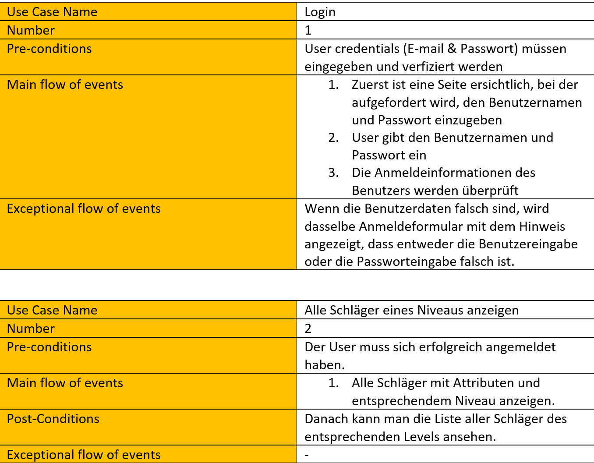
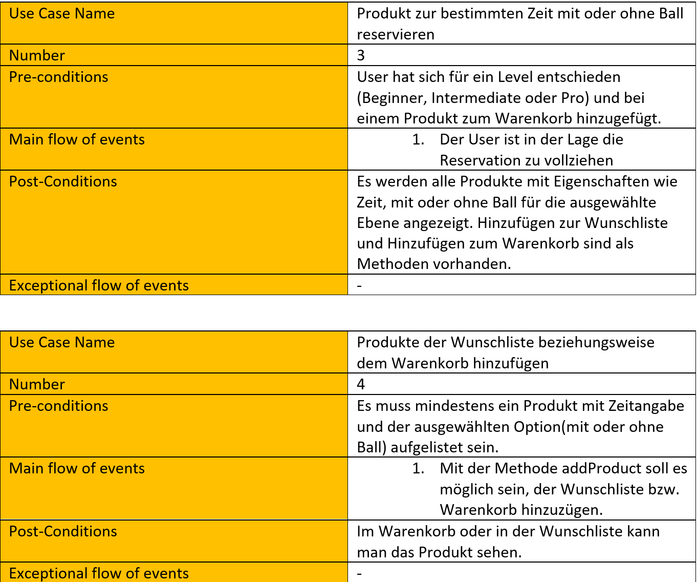
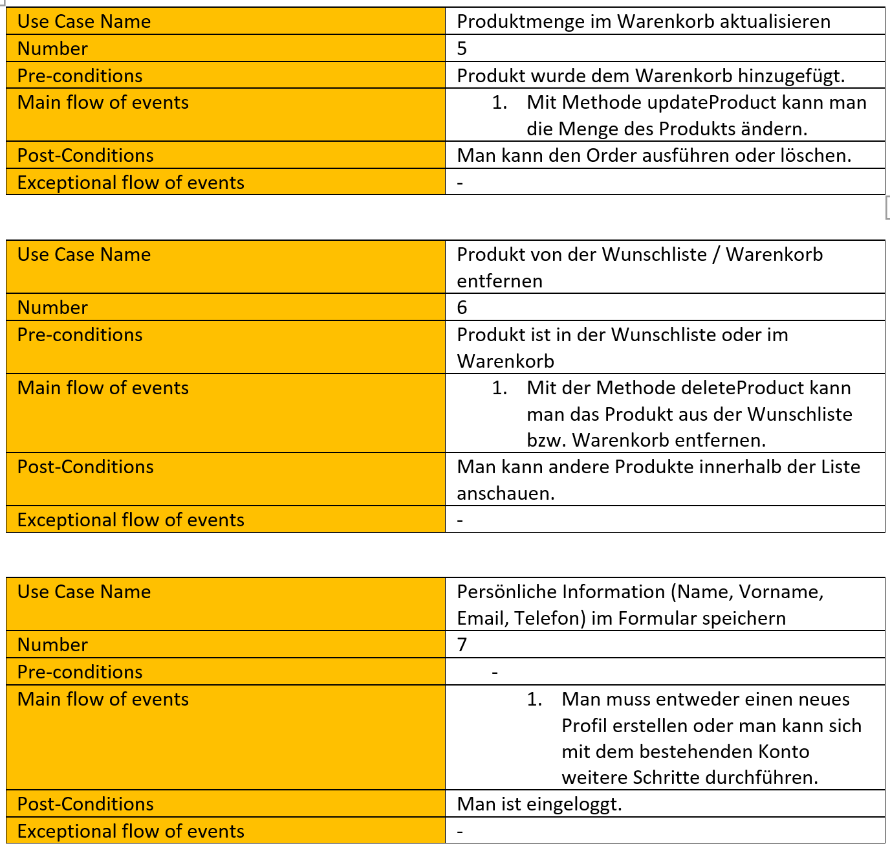
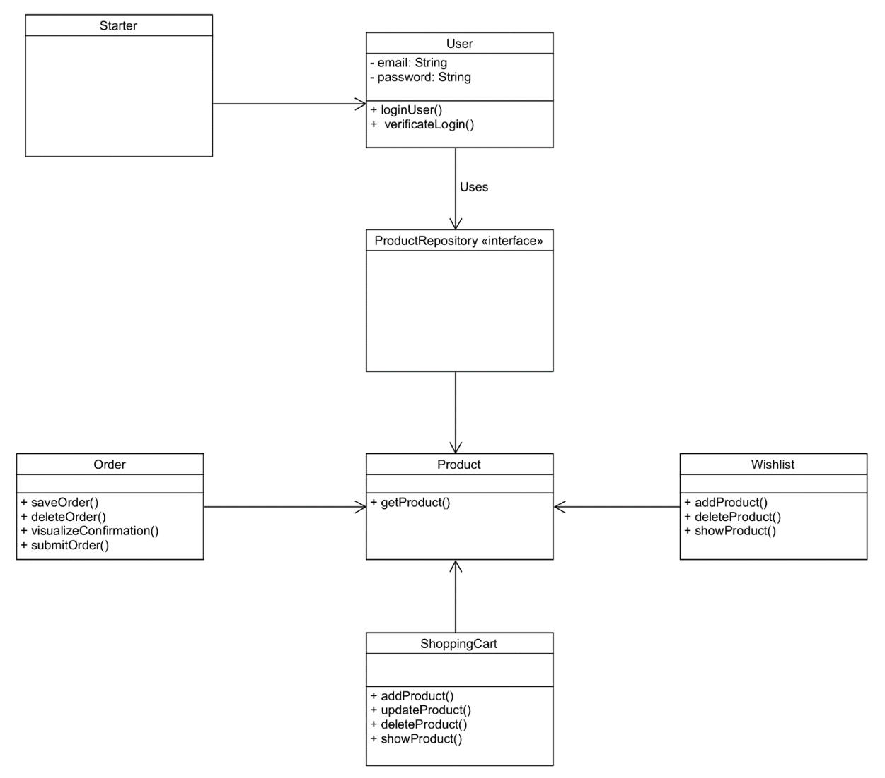
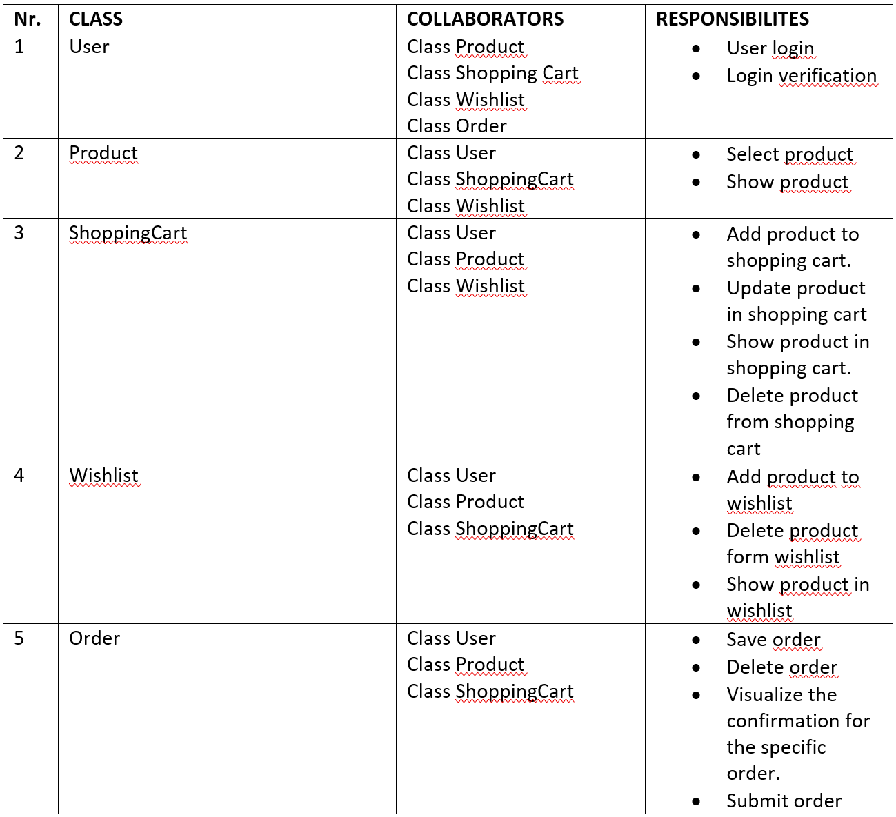
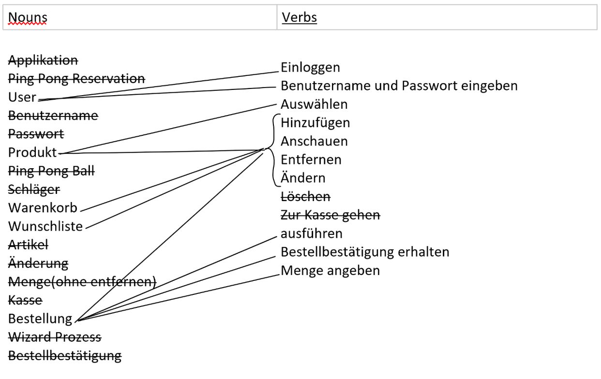
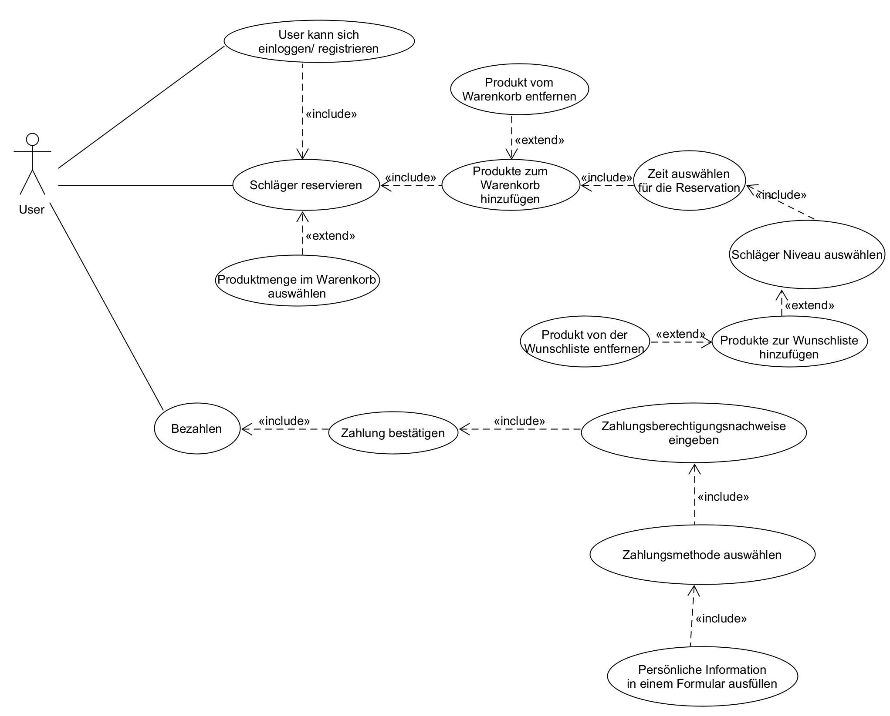
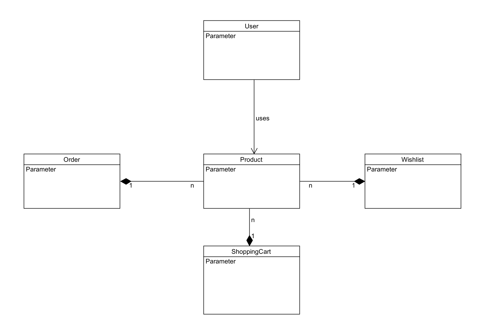

# Ping Pong Schläger-Reservation
# Inhalt
1. [Beschreibung](#beschreibung)
2. [Use cases](#usecase)
    1. [Fully dressed use cases](#fullyDressedUsecases)
3. [Diagram](#Diagram)
    1. [Klassendiagramm](#klassendiagramm)
    2. [CRC Cards](#crcCards)
    3. [Verbs & Nouns](#verbsNouns)
    4. [Use case Diagramm](#useCaseDiagramm)
    5. [Domain model](#domainModel)

## Beschreibung 
Mit diesem Tool kann sich der Benutzer beim Reservierungstool anmelden oder registrieren und einen oder mehrere Tischtennisschläger reservieren. Das Tool bietet dem Benutzer weitere Funktionen, wie z. B. die Auswahl, welches Niveau, wie viele Schläger, ob mit oder ohne Tischtennisbälle und für wie lange.

## Use cases 
### Fully dressed use cases 

## Diagram 

### Klassendiagramm 

### CRC Cards 

### Verbs & Nouns 

### Use case Diagramm 

### Domain model 

